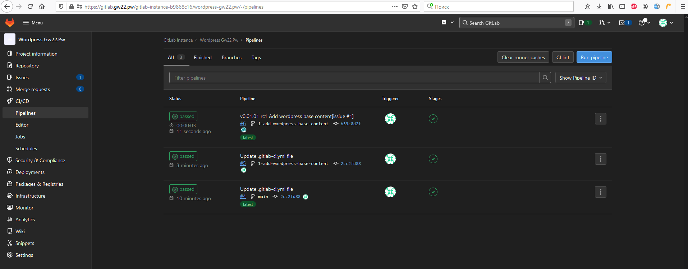

# Дипломное задание по курсу «DevOps-инженер»
[/olekirs/netology-devops ](https://github.com/OleKirs/netology-devops/edit/master/README.md)

## Дипломный практикум в YandexCloud

### Цели:  

  
Подробнее
  

1. Зарегистрировать доменное имя (любое на ваш выбор в любой доменной зоне).  

> Зарегистрировано имя `gw22.pw`   

3. Подготовить инфраструктуру с помощью Terraform на базе облачного провайдера YandexCloud. 

> Выполнено.   
>   

4. Настроить внешний Reverse Proxy на основе Nginx и LetsEncrypt.  

> Выполнено  

5. Настроить кластер MySQL.  
> Выполнено 
6. Установить WordPress.
 
> Выполнено  
7. Развернуть Gitlab CE и Gitlab Runner.  
> Выполнено  
8. Настроить CI/CD для автоматического развёртывания приложения.  
> Выполнено  
9.  Настроить мониторинг инфраструктуры с помощью стека: Prometheus, Alert Manager и Grafana.  
> Выполнено  

### Отчёт:

1. Репозиторий со всеми Terraform манифестами и готовность продемонстрировать создание всех ресурсов с нуля.  
>   [https://github.com/OleKirs/test-yc/tree/master/terraform](https://github.com/OleKirs/test-yc/tree/master/terraform])
2. Репозиторий со всеми Ansible ролями и готовность продемонстрировать установку всех сервисов с нуля.
>   [https://github.com/OleKirs/test-yc/tree/master/ansible/playbooks](https://github.com/OleKirs/test-yc/tree/master/ansible/playbooks) 
3. Скриншоты веб-интерфейсов всех сервисов работающих по HTTPS на вашем доменном имени.
•	https://www.you.domain (WordPress)  
>  
•	https://gitlab.you.domain (Gitlab)  
>  
•	https://grafana.you.domain (Grafana)  
>  
•	https://prometheus.you.domain (Prometheus)  
>  
>  
•	https://alertmanager.you.domain (Alert Manager)  
>  
>  

5. Все репозитории рекомендуется хранить на одном из ресурсов (github.com или gitlab.com).
> Ссылка на репозиторий: [https://github.com/OleKirs/test-yc.git](https://github.com/OleKirs/test-yc.git)
